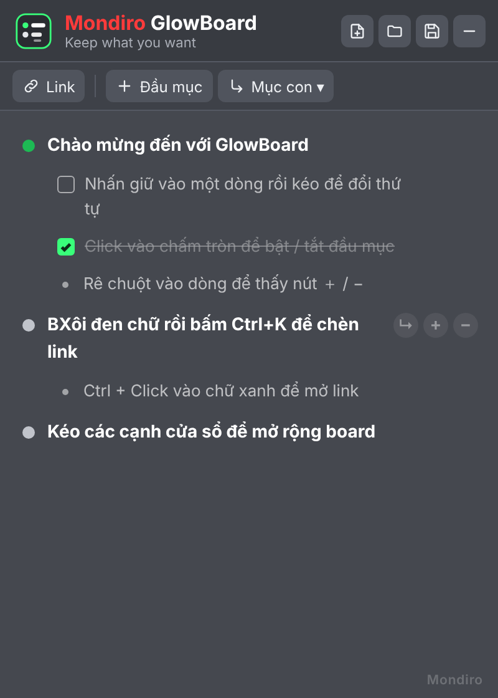

# Mondiro GlowBoard

Board ghi chú dạng widget nằm trên desktop Windows, chạy ở khay hệ thống (system tray).



## Tải về & chạy
1. Vào trang **Releases** của repo, tải `GlowBoard_Windows_x64.zip` của bản mới nhất, giải nén ra một thư mục không cần quyền admin (ví dụ `D:\Apps\GlowBoard`, **không** để trong `Program Files`).
2. Chạy `GlowBoard.exe`. App cần **Microsoft Edge WebView2 Runtime**: Windows 11 có sẵn; nếu máy bạn thiếu, app sẽ hỏi và mở trang tải về.
3. Muốn GlowBoard tự bật cùng Windows: chuột phải icon ở khay hệ thống → **Khởi động cùng Windows**.

`release/GlowBoard_Preview.html` mở thẳng bằng trình duyệt để xem thử giao diện (không cần cài).

## Cách dùng
| Thao tác | Cách làm |
|---|---|
| Bật / tắt đầu mục | Click vào chấm tròn (xanh lá = bật, trắng xám = tắt) |
| Đổi thứ tự | Nhấn giữ vào dòng rồi kéo lên/xuống (dòng đang gõ chữ: giữ ~0.3 giây rồi kéo) |
| Gõ chữ | Click vào dòng. Đầu mục luôn in đậm, mục con chữ thường |
| Thêm / xoá dòng | Rê chuột vào dòng → nút **+** / **−** ở cuối dòng (xoá sẽ hỏi lại) |
| Thêm mục con | Nút **↳** trên dòng, hoặc **Mục con ▾** trên thanh công cụ → chọn loại có ô check hoặc thường |
| Chèn link | Bôi đen chữ → `Ctrl+K` (web hoặc đường dẫn thư mục trên máy). `Ctrl+Click` để mở |
| Dòng mới | `Enter` · xuống dòng trong cùng mục: `Shift+Enter` |
| Đổi cấp | `Tab`: đầu mục → mục con · `Shift+Tab`: mục con → đầu mục |
| Lưu / Mở / Mới | `Ctrl+S` (`Ctrl+Shift+S` = Lưu thành…) · `Ctrl+O` · `Ctrl+N` |
| Di chuyển / mở rộng board | Kéo thanh tiêu đề · kéo các cạnh viền |
| Hiện board lên trên | Click icon ở khay hệ thống (board tự lùi xuống dưới khi bạn click ra chỗ khác) |

Board **tự lưu** liên tục: vào file `.gboard` đang mở, hoặc vào `%APPDATA%\Mondiro\GlowBoard\board.gboard` nếu chưa lưu thành file.

## Tự cập nhật
Mỗi lần push thay đổi trong `src/` lên GitHub, GitHub Actions (`.github/workflows/release.yml`) tự build và tạo một **Release** mới (`v1.0.<số lần build>`).
App kiểm tra bản mới 30 giây sau khi mở và mỗi 2 giờ. Khi có bản mới, app tải sẵn và tự khởi động lại lúc bạn không thao tác trên board.
Chuột phải icon ở khay hệ thống → **Kiểm tra cập nhật** để cập nhật ngay.

Repo đang private nên app cần một token chỉ-đọc. Token được GitHub gắn vào app lúc build (lấy từ Secrets), không nằm trong source code.
**Cài đặt một lần:**
1. GitHub → ảnh đại diện → **Settings** → **Developer settings** → **Personal access tokens** → **Fine-grained tokens** → **Generate new token**.
   - Repository access: **Only select repositories** → chọn `Mon_Keep`
   - Permissions → Repository permissions → **Contents: Read-only**
   - Expiration: chọn dài nhất có thể (hết hạn thì tạo token mới và làm lại bước 2)
2. Repo `Mon_Keep` → **Settings** → **Secrets and variables** → **Actions** → **New repository secret**
   - Name: `GLOWBOARD_UPDATE_TOKEN` · Secret: dán token vừa tạo
3. Repo → tab **Actions** → **Build & Release GlowBoard** → **Run workflow** để tạo bản có gắn token.
4. Tải bản đó từ trang Releases và cài một lần. Từ đó về sau app tự cập nhật.

Lưu ý: ai có file app đều có thể lấy token ra để đọc source code của repo (token chỉ đọc, không sửa được gì).

## Build từ source
Cần .NET SDK 8 (build được trên Windows hoặc Linux):
```
cd src/GlowBoard
dotnet build -c Release
```
Kết quả nằm ở `src/GlowBoard/bin/Release/net48/`. App chạy trên .NET Framework 4.8 (có sẵn trong Windows 10/11) nên không cần cài thêm gì.

- `Web/index.html`: toàn bộ giao diện board (HTML/CSS/JS), được nhúng vào exe
- `MainForm.cs`: cửa sổ widget, khay hệ thống, lưu/mở file
- `Assets/`: icon app

Created by Mondiro
